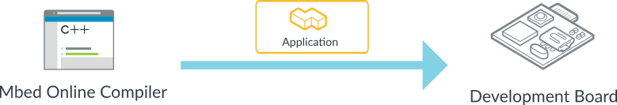
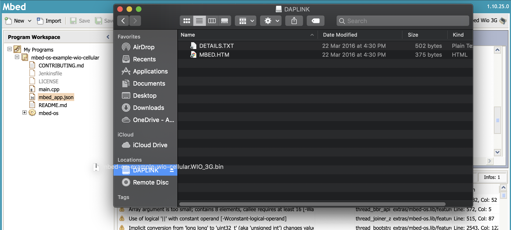

# Pelion Connectivity Management Qucik Start
This guide provides a quick introduction to the Pelion CM(Connectivity Management) platform based on Mbed OS.

# 1. Prepare the SIM card and Activiation
This section requires a plastic SIM card. Currently, if you would like to set up new tariff agreements, please contact to [here](https://www.arm.com/products/iot/pelion-iot-platform/connectivity-management/talk-with-an-expert)

## 1.1 Ordering Stock
After you've signed in to the Connectivtivity Management, one of the first things you may want to do is order stock for your inventory. Depending on the tariff agreements you've signed up for, you can use Connectivtivity Management to order:([how to place an order](https://help.iot-x.com/quickstart/ordering-stock#OrderingStock-HowtoPlaceanOrder))

  * SIM cards.
  * eSIM profiles.
  * Satellite devices.

<center> 
</img>
</center> 

## 1.2 Subscriber Activations
When your subscribers are ready to go live, you can perform activations using Connectivtivity Management.
Activations can be performed using the platform's Inventory or Activate section. Please see [here](https://help.iot-x.com/userguide/subscriber-activations)

The following screenshot displays the Activate Overview Page and highlights the key actions that can be conducted in this section.
    

  1. Click on the Activate icon to access this page.
  2. This section allows you to perform activations by uploading a CSV file to the platform.
  3. This section allows you to perform activations by pasting subscriber information into the text box.
  4. This section displays the subscribers that have recently been added to your inventory.
     Click on any of the subscribers in this panel to add it to the list of activations.

# 2. Importing the example application to the Mbed Online Compiler
You’re going to use the Mbed Online Compiler to configure and build the example application. The Online Compiler needs to access your Mbed account and to know which device you're using.

<center> 
</img>
</center> 

## 2.1 Choose a board for each connectivity method
There are various communication standards, such as WCDMA, CDMA2000, HSPA+, LTE, and so on for each country. It is not necessary to deeply understand each communication protocol, but you should know if the cellular modem's communication method is appropriate for your country. This section uses development boards that use 3G communication, which is available in most countries. Cat M1 and NB-IoT are currently available in the UK only, with roaming services will be added for other countries soon.

You can find board that include cellular modem [here](https://os.mbed.com/platforms/?q=&Communication=Cellular). In this session, it will use a board that can use 3G communication.

  1. [Seed Wio 3G](https://os.mbed.com/platforms/Seeed-Wio-3G/)
  2. [DISCO0-L495AG + UG96](https://os.mbed.com/platforms/ST-Discovery-L496AG/); [The P-L496G-CELL01 STM32 decovery pack](https://www.st.com/en/evaluation-tools/p-l496g-cell01.html)

## 2.2 Importing target board and the example code
  a. You need to tell the Online Compiler which device you will be targeting. Click the button below to import the Seeed Wio 3G into the Online Compiler.

> [Add Seeed Wio 3G to the Online Compiler](https://os.mbed.com/platforms/Seeed-Wio-3G/add/) 

  b. Click the button below to import the example application for your device into the Online Compiler.
      
> [Import Cellular example into the Online Compiler](https://ide.mbed.com/compiler#import:https://github.com/ARMmbed/mbed-os-example-cellular)
      
  c. The Online Compiler Import Program dialog is displayed. Ensure Update all libraries to the latest revision is not selected and click Import.    

<center> 
</img></div>
</center>  

# 3. Putting the application on your device
You are now ready to build the application and flash it to your device over USB.

<center> 
</img></div>
</center>  

 a. APN, Username and Password settings are required to use Pelion CM.
 Open `mbed_app.json` and put APN, Username and Password as below

```
     "nsapi.default-cellular-apn": "\"stream.co.uk\"",
     "nsapi.default-cellular-username": "\"streamip\"",
     "nsapi.default-cellular-password": "\"streamip\""
```

 b. Make sure your device is selected as a compilation target in the top right-hand corner. If your device is not selected, click Select a platform.


  
 c. To create the application binary, click Compile.


 d. The binary is downloaded to your browser's default download location. Drag and drop the compiled binary to the device.

<center> 
</img>
</img>
</center> 

 
 e. Ensure your device is connected to power and press the reset button.
 

You should see an output similar to this:
```
    mbed-os-example-cellular
    Establishing connection ......

    Connection Established.
    TCP: connected with echo.mbedcloudtesting.com server
    TCP: Sent 4 Bytes to echo.mbedcloudtesting.com
    Received from echo server 4 Bytes


    Success. Exiting
```

## 4. Seeing the device resources in Connectivtivity Management Portal
The following screenshot displays the Active page.
You access this page by navigating to `Devices > Active`.

Subscribers that can connect to the network and are included as part of the account's invoice.

<center> 
</img>
</center> 

You are now connected and can use Pelion Connectivity Management!

You have:

* Prepare the SIM card and Activiation.
* Imported the example application for your device to the Online Compiler.
* Put the application onto your device.
* Checked the device resources in the Connectiviy Management Portal.
