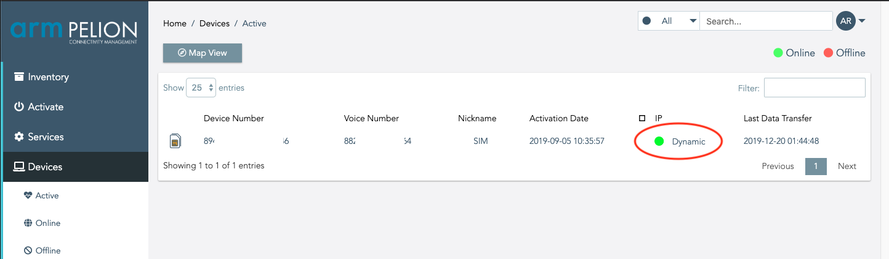

# Pelion Connectivity Management Quick Start
This guide provides a quick introduction to the Pelion Connectivity Management platform based on Mbed OS.

Let's access to [Pelion Connectivity Management](http://stream.iot-x.com/)!
<center> 
</img>
</center> 


# 1. Prepare the SIM card and Activation
In this quick start guide, requires a plastic SIM card. Currently, if you would like to set up new tariff agreements, please contact [here](https://www.arm.com/products/iot/pelion-iot-platform/connectivity-management/talk-with-an-expert).


## 1.1 Prepare the SIM card 
There are two plastic SIM card designs, and both can use Connectivtivity Management. These SIM cards included mini (2FF), micro (3FF) and nano (4FF) format.

<center> 
</img>
    or    
</img>
</center> 

## 1.2 Activations 
After you've signed in to the Connectivtivity Management, one of the first things you may want to do is activation your plastic SIM cards. Activations can be performed using the platform's Inventory or Activate section.


<center> 
</img>
</center>  

> A more detailed description of each item and each steps can be found [here](https://help.iot-x.com/userguide/subscriber-activations).

# 2. Importing the example application to the Mbed Online Compiler
In this section, you can compile and binary download onto the target board. If you are unfamiliar with how to compile and load code, [Mbed OS Quickstart tutorial](https://os.mbed.com/docs/mbed-os/v5.15/quick-start/index.html) will help you.

You’re going to use the Mbed Online Compiler to configure and build the example application. The Online Compiler needs to access your Mbed account and to know which device you're using.

<center> 
</img>
</center> 

## 2.1 Choose a board for each connectivity method
There are various communication standards, such as WCDMA, CDMA2000, HSPA+, LTE, and so on for each country, and it depends on the policy of each country.

It is not necessary to deeply understand each communication protocol, but you should know if the cellular modem's communication method is appropriate for your country. 

This section uses development boards that use 3G communication, which is available in most countries. Cat M1 and NB-IoT are currently available in the United Kingdom only, with roaming services will be added for other countries soon.

  1. [Seed Wio 3G](https://os.mbed.com/platforms/Seeed-Wio-3G/)
  2. [DISCO0-L495AG + UG96](https://os.mbed.com/platforms/ST-Discovery-L496AG/); [The P-L496G-CELL01 STM32 discovery pack](https://www.st.com/en/evaluation-tools/p-l496g-cell01.html)

You can find a board that includes cellular modem [here](https://os.mbed.com/platforms/?q=&Communication=Cellular) or can develop based on Cellular Module + MCU type. You can find a cellular modules source code of each major vendor product [here](https://github.com/ARMmbed/mbed-os/tree/master/features/cellular/framework/targets).


## 2.2 Importing target board and the example code
  a. You need to tell the Online Compiler which device you will be targeting. Click the button below to import the `Seeed Wio 3G` into the Online Compiler.

> [Add Seeed Wio 3G to the Online Compiler](https://os.mbed.com/platforms/Seeed-Wio-3G/add/) 

  b. Click the button below to import the example application for your device into the Online Compiler.
      
> [Import Cellular example into the Online Compiler](https://ide.mbed.com/compiler#import:https://github.com/ARMmbed/mbed-os-example-cellular)
      
  c. The Online Compiler Import Program dialog is displayed. Ensure Update all libraries to the latest revision is not selected and click Import.    

<center> 
</img>
</center>  


# 3. Putting the application on your device
You are now ready to build the application and flash it to your device over USB.

<center> 
</img>
</center>  

 a. Make sure your device is selected as a compilation target in the top right-hand corner. If your device is not selected, click Select a platform.


  
 b. You should already have the following APN details to allow it to connect into the network. Open `mbed_app.json` and put APN, Username, and Password as below

```
            "nsapi.default-cellular-apn": "\"stream.co.uk\"",
            "nsapi.default-cellular-username": "\"streamip\"",
            "nsapi.default-cellular-password": "\"streamip\""
```
> Note that APN, Username, and Password are dependent on the agreement. When you get a 'Welcome email' from Pelion Connectivity Management, there is this information.

 c. To create the application binary, click Compile.


 d. The binary is downloaded to your browser's default download location. Drag and drop the compiled binary to the device.

<center> 
</img>
</img>
</center> 

 e. Ensure your device is connected to power and press the reset button.
 
  Once your code is up and running, you should see output to the following on your serial terminal, such as [CoolTerm](http://freeware.the-meiers.org/), [TeraTerm](https://osdn.net/projects/ttssh2/releases/), and [putty](https://www.chiark.greenend.org.uk/~sgtatham/putty/). 
  
  Set the `baudrate to 115200 bit/s`, and reset your board by pressing the reset button.

```
  mbed-os-example-cellular

  Built: Jan  7 2020, 13:32:52
  Establishing connection

  Connection Established.
  TCP: connected with echo.mbedcloudtesting.com server
  TCP: Sent 4 Bytes to echo.mbedcloudtesting.com
  Received from echo server 4 Bytes

  Success. Exiting 
```

<center> 
</img>
</center> 


# 4. Verify board connects to Pelion

<center> 
</img>
</center> 

The following screenshot displays the Active page.
You access this page by navigating to `Devices -> Active`.

<center> 
</img>
</center> 

You have now connected the internet via cellular, and you can check your device's connectivity status, data usage, and so on with the Pelion Connectivity Management!

---------------------------------------

**Using the Mbed Online Compiler and Pelion Connectivity Management you have:**

* Prepare the SIM card and Activation.
* Import the example application for your device to the Online Compiler.
* Made a change to the example application using the Online Compiler.
* Put the application onto your device.
* Can check the device resources in the Connectivity Management Portal.


# 5. What Next?
* You can follow the [Pelion Device Management IoT Connection Tutorial](https://os.mbed.com/guides/connect-device-to-pelion/) via Connectivity Management.
   

   *Don't forget to put Connectivity Management's APN, Username, and Password to the `mbed_app.json` in tutorial's "Step 3: Putting the application on your device"*
   ```
            "lwip.ppp-enabled"                      : true,
            ...
            "nsapi.default-cellular-apn"            : "\"stream.co.uk\"",
            "nsapi.default-cellular-username"       : "\"streamip\"",
            "nsapi.default-cellular-password"       : "\"streamip\""
   ```

**Learn more about building IoT devices with Mbed OS and the Pelion IoT Platform:**

* [Browse for Mbed-compatible boards to add to the Online Compiler](https://os.mbed.com/platforms/).
* [Browse for programs to import to the Online Compiler](https://os.mbed.com/code/).
* [Review the production workflow](https://os.mbed.com/docs/mbed-os/v5.15/mbed-os-pelion/going-to-production.html).
* Learn [Cellular API](https://os.mbed.com/docs/mbed-os/v5.15/apis/cellular-api.html) of Mbed OS.
* [Cellular configuration documentation](https://os.mbed.com/docs/mbed-os/v5.15/reference/configuration-connectivity.html).
* Explore the Connectivity Management service [APIs](https://help.iot-x.com/api-home) and [Users Guide](https://help.iot-x.com/userguides).


