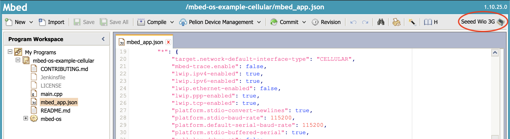
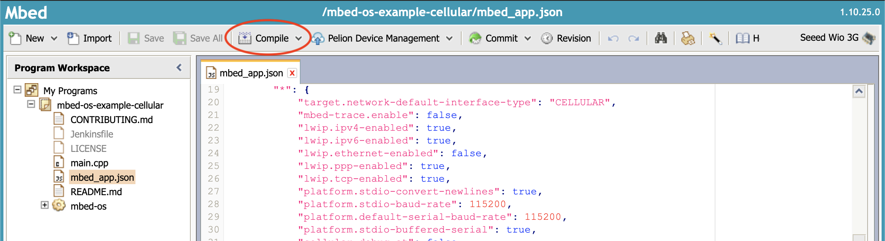

# Pelion Connectivity Management Quick Start
This guide provides a quick introduction to the Pelion Connectivity Management Platform and Mbed Online Compiler.

This guide shows you how to:

* Activate a SIM card using Pelion Connectivity Management
* Import an example application for your device using the Mbed Online Compiler
* Make a change to an example application using the Mbed Online Compiler
* Upload an application to your device
* Verify that your device is connected to the internet using Pelion Connectivity Management

Let's sign in to [Pelion Connectivity Management](http://stream.iot-x.com/) portal!
<center> 
</img>
</center> 

# 1. Activate Your SIM

To complete the steps in this guide, you must have a Pelion Connectivity Management SIM card.

If you already have a connectivity service agreement with Arm, you can [order SIM cards using the Pelion Connectivity Management Platform](https://help.iot-x.com/quickstart/ordering-stock). If you would like to set up a connectivity service agreement, please [contact us for further information](https://www.arm.com/products/iot/pelion-iot-platform/connectivity-management/talk-with-an-expert).


## 1.1 Prepare the SIM 
Pelion Connectivity Management SIM cards are available in two designs, and a variety of form factors, including mini (2FF), micro (3FF), and nano (4FF). Before ordering your SIM card, make sure the SIM’s form factor is compatible with your device.

<center> 
</img>
    or    
</img>
</center> 

## 1.2 Activation
You can activate your SIM using the Pelion Connectivity Management platform’s Inventory or Activate feature. 

<center> 
</img>
</center>  

You can find a more detailed description of the steps in this process [here](https://help.iot-x.com/userguide/subscriber-activations). If you are activating your SIM on a billable tariff, it will start to generate billable events as soon as it is activated by the network operator. In some cases, network operators can take from 24 to 48 hours to process activation requests. We recommend that you allow enough lead time to activate your SIM. 

> When you activates a SIM card, you must also specify the tariff/rate plan that the SIM will be activated on. In this regard, you can find a more detailed from [help docs](https://help.iot-x.com/quickstart/performing-activations).

# 2. Importing the Example Application to the Mbed Online Compiler
In this section, you will compile and flash the firmware onto the target board. If you are unfamiliar with how to compile and flash the firmware, please follow the [Mbed OS Quickstart tutorial](https://os.mbed.com/docs/mbed-os/v5.15/quick-start/index.html) first.

You’re going to use the Mbed Online Compiler to configure and build the example application. The Online Compiler needs to access your Mbed account and to know which device you're using.

<center> 
</img>
</center> 

## 2.1 Choose a Board for Each Connectivity Method
There are various communication standards such as WCDMA, CDMA2000, HSPA+, LTE widely deployed in the world and each country chooses to support one or the other based on each country's specific characteristics and defined policies.

It is not necessary to deeply understand each communication protocol, but you should verify that the cellular modem's communication method is appropriate for your country. 

This section uses development boards that use 3G communication, which is available in most countries. Cat M1 and NB-IoT are currently available in the United Kingdom only, with roaming services planned to be rolled out to other countries soon.

  1. [Seeed Wio 3G](https://os.mbed.com/platforms/Seeed-Wio-3G/)
  2. [DISCO0-L495AG + UG96](https://os.mbed.com/platforms/ST-Discovery-L496AG/); [The P-L496G-CELL01 STM32 discovery pack](https://www.st.com/en/evaluation-tools/p-l496g-cell01.html)

You can find a board that includes cellular modem support on the Mbed web site [here](https://os.mbed.com/platforms/?q=&Communication=Cellular) or you can develop based on Cellular Module + MCU type. You can find a cellular modules source code for each major vendor product [here](https://github.com/ARMmbed/mbed-os/tree/master/features/cellular/framework/targets).


## 2.2 Importing Target Board and the Example Code
  a. You need to tell the Online Compiler which device you will be targeting. Click the button below to import the `Seeed Wio 3G` into the Online Compiler.

> [Add Seeed Wio 3G to the Online Compiler](https://os.mbed.com/platforms/Seeed-Wio-3G/add/) 

  b. Click the button below to import the example application for your device into the Online Compiler.
      
> [Import Cellular example into the Online Compiler](https://ide.mbed.com/compiler#import:https://github.com/ARMmbed/mbed-os-example-cellular)
      
  c. The Online Compiler Import Program dialog is displayed. Ensure Update all libraries to the latest revision is not selected and click Import.    

<center> 
</img>
</center>  


# 3. Putting the Application on Your Device
You are now ready to build the application and flash it to your device over USB.

<center> 
</img>
</center>  

 a. Make sure your device is selected as a compilation target in the top right-hand corner. If your device is not selected, click Select a platform.


  
 b. You should already have the following APN details to allow it to connect to the network. Open `mbed_app.json` and put APN, Username, and Password as below

```
            "nsapi.default-cellular-apn": "\"stream.co.uk\"",
            "nsapi.default-cellular-username": "\"streamip\"",
            "nsapi.default-cellular-password": "\"streamip\""
```
> Note that APN, Username, and Password are dependent on the agreement. You can find it in the 'Welcome Email' of Pelion Connectivity Management.

 c. To create the application binary, click Compile.



 d. The binary is downloaded to your browser's default download location. Drag and drop the compiled binary to the device.

<center> 
</img>
</img>
</center> 

 e. Ensure your device is connected to power and press the reset button.
 
  Once your code is up and running, you should see output to the following on your serial terminal, such as [CoolTerm](http://freeware.the-meiers.org/), [TeraTerm](https://osdn.net/projects/ttssh2/releases/), and [putty](https://www.chiark.greenend.org.uk/~sgtatham/putty/). 
  
  Set the `baudrate to 115200 bit/s`, and reset your board by pressing the reset button.

```
  mbed-os-example-cellular

  Built: Jan  7 2020, 13:32:52
  Establishing connection

  Connection Established.
  TCP: connected with echo.mbedcloudtesting.com server
  TCP: Sent 4 Bytes to echo.mbedcloudtesting.com
  Received from echo server 4 Bytes

  Success. Exiting 
```


<center> 
</img>
</center> 

# 4. Verify Your Board Connects to Pelion Connectivity Management

<center> 
</img>
</center> 

You can verify that your device is connected to Pelion Connectivity Management using the Active feature. You access this page by navigating to `Devices -> Active`.

<center> 
</img>
</center> 

Your board is now connected to the internet via the cellular network. You can check your board's connectivity status, data usage, and more using the Pelion Connectivity Management platform.

---------------------------------------

**Using the Mbed Online Compiler and Pelion Connectivity Management you have:**

* Activated a SIM card using Pelion Connectivity Management
* Imported an example application for your device using the Mbed Online Compiler
* Made a change to an example application using the Mbed Online Compiler
* Uploaded an application to your device
* Verified that your device is connected to the internet using Pelion Connectivity Management


# 5. What Next?
* You can follow the [Pelion Device Management IoT Connection Tutorial](https://os.mbed.com/guides/connect-device-to-pelion/) via Connectivity Management.
   

   *Don't forget to put Connectivity Management's APN, Username, and Password to the `mbed_app.json` in tutorial's "Step 3: Putting the application on your device*

   ```
            "lwip.ppp-enabled"                      : true,
            ...
            "nsapi.default-cellular-apn"            : "\"stream.co.uk\"",
            "nsapi.default-cellular-username"       : "\"streamip\"",
            "nsapi.default-cellular-password"       : "\"streamip\""
   ```
----
**Learn more about building IoT devices with Mbed OS and the Pelion IoT Platform:**

* [Browse for Mbed-compatible boards to add to the Online Compiler](https://os.mbed.com/platforms/).
* [Browse for programs to import to the Online Compiler](https://os.mbed.com/code/).
* [Review the production workflow](https://os.mbed.com/docs/mbed-os/v5.15/mbed-os-pelion/going-to-production.html).
* Learn [Cellular API](https://os.mbed.com/docs/mbed-os/v5.15/apis/cellular-api.html) of Mbed OS.
* [Cellular configuration documentation](https://os.mbed.com/docs/mbed-os/v5.15/reference/configuration-connectivity.html).
* Explore the Connectivity Management service [APIs](https://help.iot-x.com/api-home) and [Users Guide](https://help.iot-x.com/userguides).
* Explore Mbed and Pelion Device Management support [forum](https://forums.mbed.com/)

